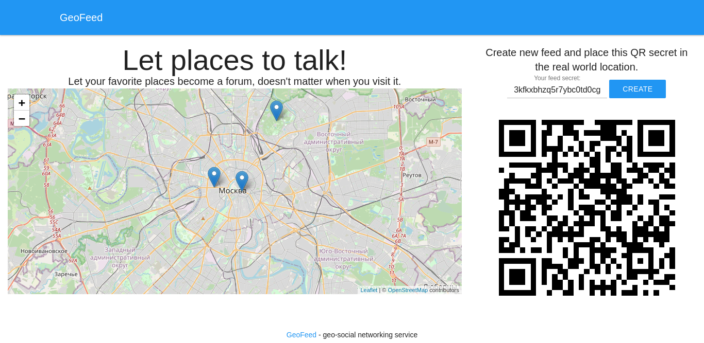

## GeoFeed
geo-social networking service

**For [demonstration](https://qrfeedcavava7669boersycom.pythonanywhere.com/) purpose secrets are NOT secret**
- location based communication
- no registration
- reactive UI
- responsive design



### Technologies

- frontend: [Vue.JS](https://vuejs.org/), [Leaflet](https://leafletjs.com), [MUI](https://www.muicss.com)
- backend: [Django](https://www.djangoproject.com/), [Django REST Framework (DRF)](https://www.django-rest-framework.org/)

### Run locally
Prepare environment:
```
pip3 install virtualenv
virtualenv -p /usr/bin/python3.8 venv3
source venv3/bin/activate
pip install -r GeoFeed/requrements.txt 
python GeoFeed/manage.py migrate --run-syncdb
```
Run server:
```
python GeoFeed/manage.py runserver
```
